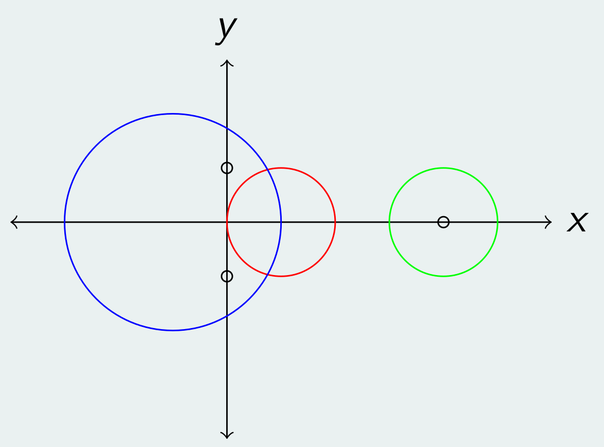
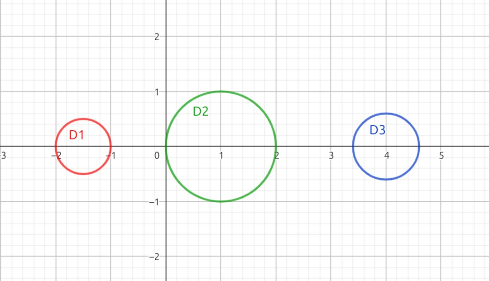

# Autovalores

## Definición

Sea $A \in \mathbb{C}^{n \times n}$. $\lambda \in \mathbb{C}$ es un autovalor de $A$ sii existe $v \in \mathbb{C}^n$, $v \neq 0$ tal que:

$$
Av = \lambda v
$$

Decimos que $v$ es un autovector asociado al autovalor $\lambda$. Para encontrar los autovalores podemos desarrollar la definición de la siguiente manera:

$$
Av = \lambda v \iff Av - \lambda v = 0 \iff (A - \lambda I) v = 0
$$

Como $v \neq 0$, la igualdad solo se cumple si:

$$
v \in Nu(A - \lambda I) \iff Nu(A - \lambda I) \neq \{0\} \iff A \text{ no inversible} \iff det(A - \lambda I) = 0
$$

Al desarrollar la fórmula del determinante obtenemos el **polinomio característico** de la matriz: $P(\lambda) = det(A - \lambda I)$. Luego $\lambda$ es autovalor de $A$ sii $\lambda$ es raíz de $P(\lambda)$.

Ya sabemos encontrar los autovalores. ¿Cómo podemos obtener los autovectores? Para cada autovalor $\lambda$ volvemos a la definición original y reemplazamos el autovalor en el sistema dado por $(A - \lambda I) v = 0$. Luego resolvemos ese sistema homogéneo para encontrar $v$.

## Autoespacios y multiplicidad

**Los autovectores son las direcciones que se preservan al aplicar la transformación lineal $A$.** El autovalor asociado codifica cuánto se estira o contrae en la dirección del autovector. Por eso, si $v$ es un autovector asociado a $\lambda$, entonces $\alpha v$ para cualquier $\alpha \in \mathbb{R}$ también es un autovector asociado a $\lambda$.

Definimos el **autoespacio** asociado al autovalor $\lambda$ como el subespacio $S_{\lambda} = Nu(A - \lambda I)$. Todos los autovectores asociados a $\lambda$ están en $S_{\lambda}$. La multiplicidad geométrica del autovalor $\lambda$ está dada por la dimensión del autoespacio: $m_G(\lambda) = dim(S_{\lambda})$.

Por otro lado, el polinomio característico $P(\lambda)$ tiene $n$ raíces contadas con multiplicidad. No obstante, pueden haber raíces complejas no reales y raíces múltiples. Si $\lambda \not\in \mathbb{R}$ entonces no hay autoespacio en $\mathbb{R}^n$. Llamamos $m_A(\lambda)$ a la multiplicidad algebraica del autovalor $\lambda$.

La relación entre la multiplicidad algebraica y geométrica es la siguiente:

$$
1 \leq m_G(\lambda) \leq m_A(\lambda)
$$

Si sucede que $m_G(\lambda) = m_A(\lambda)$ para todos los autovalores, entonces los autovectores forman una base de $\mathbb{R}^n$.

## Radio espectral

Se define el radio espectral de $A$ como:

$$
\rho(A) = max \{ |\lambda| : \lambda \text{ es autovalor de } A \}
$$

El radio espectral cuantifica la máxima deformación que realiza la transformación $A$ en alguna dirección. Algunos casos de uso del radio espectral son:

- Si tenemos un esquema iterativo con una matriz de iteración $T$, el esquema converge para cualquier $x_0$ inicial sii $\rho(T) < 1$.
- La norma matricial de orden 2 de una matriz $A$ coincide con la raíz del radio espectral de $A^tA$: $||A||_2 = \sqrt{\rho(A^tA)}$.

## Discos de Gershgorin

Los discos de Gershgorin nos permiten acotar los autovalores adentro de discos en el plano complejo.

Sea $A \in \mathbb{C}^{n \times n}$ y $r_i = \sum_{j=1, j \neq i}^n |a_{ij}|$ para $i=1 \dots n$. Definimos el disco de Gershgorin como:

$$
D_i = \{ x \in \mathbb{C} : |x - a_{ii}| \leq r_i \} \text{ para } i = 1 \dots n
$$

Luego, si $\lambda$ es autovalor de $A$ entonces $\lambda \in D_i$ para algún $i \in [1, n].$ Todos los autovalores están adentro de algún disco, pero puede pasar que haya discos en donde no hay ningún autovalor.

Si $M = D_{i_1} \cup D_{i_2} \cup \dots \cup D_{i_m}$ es disjunto respecto al resto de los discos entonces en $M$ hay exactamente $m$ autovalores de $A$ contados con multiplicidad.

### Ejemplos

Sean $D_1$ (azul), $D_2$ (rojo) y $D_3$ (verde) los discos de alguna matriz $A \in \mathbb{C}^{3 \times 3}$.

En $M_1 = D_1 \cup D_2$ tenemos 2 autovalores ya que $M_1 \stackrel{D}{\cup} D_3$.

En $M_2 = D_3$ tenemos 1 autovalor ya que $M_2 \stackrel{D}{\cup} (D_1 \cup D_2)$.

Si fuese el caso donde todos los $D_i$ son disjuntos, entonces en cada disco habría un único autovalor, y por lo tanto la multiplicidad algebraica de cada autovalor sería 1, dando lugar a $n$ autovalores distintos.

## Matrices semejantes

$A, B \in \mathbb{C}^{n \times n}$ son matrices semejantes si existe $P \in \mathbb{C}^{n \times n}$ matriz inversible tal que:

$$
A = P B P^{-1}
$$

Lo interesante es que si $A$ y $B$ son semejantes entonces **tienen los mismos autovalores**. La noción de semejanza viene a raíz de que la transformación que realiza $A$ en la base canónica es la misma que realiza $B$ en otra base definida por $P$. La transformación $P B P^{-1}$ en esencia hace un cambio de base, aplica la transformación $B$ y luego vuelve a la base canónica.

Cuando $A$ es semejante a una diagonal decimos que $A$ es diagonalizable:

$$
A = P D P^{-1}
$$

**$A$ es diagonalizable sii sus autovectores forman una base.** Este resultado es importante ya que significa que la transformación lineal definida por $A$ la podemos interpretar como deformaciones (estirar/contraer) realizadas sobre cada uno de los ejes canónicos. La matriz $P$ se encarga de hacer el cambio de base hacia/desde la base canónica.

Verificar si $A$ es diagonalizable puede ser muy costoso. Nos gustaría tener una forma más fácil de saber si $A$ tiene una base de autovectores.

## Propiedades

A efectos prácticos de la materia nos enfocamos en matrices con coeficientes reales. Sea $A \in \mathbb{R}^{n \times n}$.

- Si $\lambda$ es autovalor de $A$ con autovector asociado $v$, entonces $\lambda^k$ es autovalor de $A^k$ con el mismo autovector asociado $v$. Volviendo a la interpretación geométrica, aplicar $k$ veces la transformación lineal va a estirar/contraer por $\lambda^k$ a la dirección $v$ que es preservada por $A$.

- Si $A$ es una matriz ortogonal entonces sus autovalores son $\lambda = \pm 1$. Recordemos que las matrices ortogonales son transformaciones que solo rotan/reflejan sin deformar el espacio.

- Si $\lambda$ es autovalor de $A$ entonces también lo es de $A^t$. Esto se deduce a partir de que $A$ y $A^t$ tienen el mismo polinomio característico.

- Si todos los autovalores de $A$ están en $\mathbb{R}$:

    - Todos los autovectores también están en $\mathbb{R}^n$, pues se obtienen resolviendo un sistema definido completamente en $\mathbb{R}$ mediante operaciones cerradas en $\mathbb{R}$.

    - Si además todos los autovalores son distintos entonces los autovectores son linealmente independientes. Luego forman una base de $\mathbb{R}^{n}$.

    - Existen $Q, T \in \mathbb{R}^{n \times n}$ con $Q$ ortogonal y $T$ triangular superior tal que $A$ es ortogonalmente semejante a $T$. Es decir: $A = Q T Q^t$.

- Si $A$ es simétrica:

    - Todos sus autovalores están en $\mathbb{R}$.

    - Si todos los autovalores son distintos entonces los autovectores son ortogonales entre sí. Luego forman una base ortonormal de $\mathbb{R}^{n}$ si los normalizamos.

    - Existen $Q, D \in \mathbb{R}^{n \times n}$ con $Q$ ortogonal y $D$ diagonal tal que $A = Q D Q^t$. Las columnas de $Q$ son los autovectores de $A$ y $D$ contiene todos los autovalores de $A$.

## Método de la potencia

Para poder obtener los autovalores y autovectores asociados podemos utilizar un método iterativo llamado método de la potencia.

Sean $A \in \mathbb{R}^{n \times n}$, $\lambda_1 \dots \lambda_n \in \mathbb{R}$ sus $n$ autovalores y $v_1 \dots v_n \in \mathbb{R}^n$ los autovectores asociados que forman una base.

Sin pérdida de generalidad supongamos que ordenamos los autovalores tal que $|\lambda_1| > |\lambda_2| \geq \dots \geq |\lambda_n|$.

A partir de un vector arbitrario inicial $x_0 \in \mathbb{R}^n$ tal que $||x_0||_2 = 1$ definimos la sucesión $\{x_k\}$ como:

$$
x_k = \frac{A x_{k-1}}{||A x_{k-1}||_2}
$$

Dicha sucesión converge al autovector $v_1$. Para obtener el autovalor realizamos la siguiente cuenta:

$$
A v_1 = \lambda_1 v_1 \iff v_1^t A v_1 = \lambda_1 v_1^t v_1 \iff v_1^t A v_1 = \lambda_1 \underbrace{||v_1||^2_2}_{=1} \iff v_1^t A v_1 = \lambda_1
$$

Dado que los autovectores forman una base, si consideramos a $x_k$ como una combinación lineal de los autovectores, la idea del método es que en cada iteración se "acentúa" la dirección del autovector $v_1$ pues $\lambda_1$ es el autovalor más grande en módulo. Al normalizar $x_k$ para la siguiente iteración, los coeficientes que acompañan a los autovectores $v_2 \dots v_n$ tienden a $0$. Después de una cantidad lo suficientemente grande de iteraciones y gracias a la aritmética finita el único coeficiente que sobrevive es el que acompaña a $v_1$.

Generalmente se configura un máximo de iteraciones y también se puede incluir una condición de corte temprano que consiste en ver si la distancia (medida con alguna norma) entre $x_k$ y $x_{k-1}$ es menor que algún umbral. En tal caso se considera $x_k$ como suficientemente bueno y no es necesario realizar más iteraciones.

Hay que mencionar que existe una probabilidad no nula (pero muy baja) de que el $x_0$ inicial elegido de manera arbitraria justo tenga un coeficiente $\approx 0$ acompañando al autovector $v_1$ si consideramos a $x_0$ como combinación lineal de los autovectores. En este caso el método puede no converger o necesitar una cantidad excesivamente grande de iteraciones para hacerlo. Una solución consiste simplemente en reintentar el método con un nuevo $x_0$ inicial.

## Método de deflación

Utilizando el método de la potencia encontramos $\lambda_1$ y $v_1$. ¿Cómo podemos encontrar todos los autovalores y autovectores? Como ya sabemos obtener el autovalor más grande en módulo, el método de deflación consiste en obtener una nueva matriz donde el autovalor $\lambda_1$ pasó a ser el más chico y repetir así el método de la potencia sobre esta nueva matriz, hayando el nuevo autovalor más grande en módulo que será $\lambda_2$.

Sean $A \in \mathbb{R}^{n \times n}$, $\lambda_1 \in \mathbb{R}$ autovalor con autovector asociado $v_1 \in \mathbb{R}^n$ tal que $|\lambda_1| > |\lambda_2| \geq \dots \geq |\lambda_n|$..

Sea $H \in \mathbb{R}^{n \times n}$ matriz ortogonal tal que $H v_1 = e_1$.

$$
H A H^t = \begin{bmatrix}
\lambda_1 & a^t \\
0 & \tilde{A}
\end{bmatrix}
$$

Notemos que $A$ y $H A H^t$ tienen los mismos autovalores. Si planteamos el polinomio característico de $H A H^t$ obtenemos:

$$
det(H A H^t - \lambda I) = (\lambda_1 - \lambda) * det(\tilde{A} - \lambda I)
$$

Entonces el resto de los autovalores de $A$: $\lambda_2 \dots \lambda_n$ son autovalores de $\tilde{A}$. Para encontrar el resto de los autovalores (o la cantidad que se necesite) simplemente repetimos el método de la potencia sobre esta nueva matriz $\tilde{A}$ para encontrar $\lambda_2$. Luego volvemos a aplicar la deflación y así sucesivamente.
