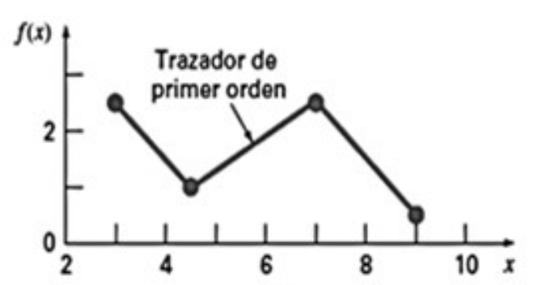
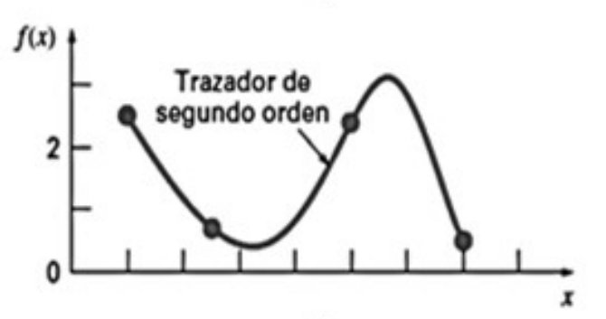
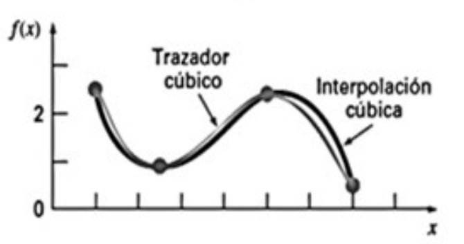

# Interpolación

## Motivación

Dado un conjunto de datos compuesto de pares ordenados $\{ (x_0, y_0), \dots, (x_n, y_n) \}$ buscamos un polinomio $P(x)$ tal que:

$$
P(x_i) = y_i \hspace{2em} \text{para todo } i = 0 \dots n
$$

Decimos que el polinomio **interpola** los datos porque pasa por todos los puntos de nuestro conjunto. Si éstos describen algún fenómeno, nos gustaría utilizar el polinomio para predecir puntos desconocidos.

## Polinomio interpolante

Definimos $n+1$ polinomios de grado $n$ de la siguiente manera:

$$
L_{nk} = \prod_{\substack{i=0 \\ i \neq k}}^n \frac{x - x_i}{x_k - x_i}
$$

Observemos que cada $L_{nk}$ tiene un comportamiento particular al ser evaluado en los puntos del dataset:

- $L_{nk}(x_i) = 0$ para todo $i = 0 \dots n, i \neq k$

- $L_{nk}(x_k) = 1$

Luego definimos el polinomio interpolante de grado $\leq n$ como:

$$
P(x) = \sum_{k=0}^n y_k L_{nk}(x)
$$

Al evaluar $P(x_i)$ para algún $i = 0 \dots n$ lo que sucede es que $y_i L_{ni}(x_i) = y_i * 1 = y_i$. Todos los otros $n$ términos de la sumatoria se anulan pues $L_{nk}(x_i) = 0$ si $i \neq k$.

$$
P(x_i) = y_i \hspace{2em} \text{para todo } i = 0 \dots n
$$

Luego $P(x)$ es el polinomio interpolante y además siempre existe.

## Error

Sean $f \in C^{n+1}[a,b]$ una función definida en el intervalo $[a,b]$ y el conjunto de pares ordenados $\{ (x_i, f(x_i)) : x_i \in [a,b] \text{ para todo } i = 0 \dots n \}$. Sabemos que existe un polinomio interpolante $P(x)$ de grado $\leq n$ tal que $P(x_i) = f(x_i)$ para todo $i = 0 \dots n$.

Dado $\overline{x} \in [a,b]$, $\overline{x} \neq x_i$ para todo $i = 0 \dots n$, queremos conocer el error cometido al aproximar $f(\overline{x})$ con $P(\overline{x})$.

Para esto sabemos que existe una función $\xi(\overline{x})$ tal que:

$$
f(\overline{x}) = P(\overline{x}) + \frac{f^{n+1}(\xi(\overline{x}))}{(n+1)!} \prod_{i=0}^n (\overline{x} - x_i)
$$

## Unicidad

Dado un conjunto de datos $\{ (x_0, y_0), \dots, (x_n, y_n) \}$ el polinomio interpolante de grado $\leq n$ es único.

Supongamos que existen 2 polinomios interpolantes distintos $P_1$ y $P_2$. Podemos considerar a $P_2$ como un polinomio interporlante de $P_1$ pues interpolan a los mismos datos: $P_2(x_i) = P_1(x_i)$ para todo $i = 0 \dots n$.

Como $P_1$ es de grado $\leq n$ su derivada de orden $n+1$ se anula. A partir de la fórmula del error podemos deducir que entonces $P_1 = P_2$.

## Métodos para obtener el polinomio interpolante

Ya sabemos que siempre existe el polinomio interporlante y que además es único salvo reescrituras. Supongamos que ya tenemos construido el polinomio interpolante para nuestros datos y ahora obtenemos nuevos puntos. ¿Cómo podemos actualizar el polinomio interporlante si se agregan nuevos puntos al dataset?

Si lo construimos a partir de los polinomios $L_{nk}$ tenemos que volver a repetir todo el proceso desde cero. Para evitar esto existen 2 formas (similares) de construcción del polinomio interporlante tal que permiten actualizarlo a partir de nuevos puntos sin necesidad de repetir pasos ya realizados.

### Diferencias divididas

Dados $(x_i, f(x_i))$ para $i = 0 \dots n$ definimos las diferencias divididas como:

- Orden $0$: $f[x_i] = f(x_i)$

- Orden $1$: $f[x_i, x_{i+1}] = \frac{f[x_{i+1}] - f[x_i]}{x_{i+1} - x_i}$

- Orden $k$: $f[x_i, x_{i+1}, \dots, x_{i+k}] = \frac{f[x_{i+1}, \dots, x_{i+k}] - f[x_i, \dots, x_{i+k-1}]}{x_{i+k} - x_i}$

Luego construimos el polinomio interporlante de la siguiente manera:

$$
P_n(x) = f[x_0] + f[x_0, x_1](x - x_0) + f[x_0, x_1, x_2](x - x_0)(x - x_1) \\ + \dots + f[x_0, \dots, x_n](x - x_0) \dots (x - x_{n-1})
$$

Si ahora tenemos un nuevo punto $(x_{n+1}, y_{n+1})$ podemos actualizar el polinomio interpolante $P_n$ simplemente agregando un nuevo término que utiliza las diferencias divididas de orden $n+1$. Calcular este término es fácil por la definición recursiva de las diferencias divididas (suponiendo que nos guardamos los resultados intermedios).

$$
P_{n+1}(x) = P_n(x) + f[x_0, \dots, x_{n+1}](x - x_0) \dots (x - x_n)
$$

### Proceso recursivo (Neville)

Otra forma de construir el polinomio interpolante es a partir de otros 2 polinomios que interpolan en un punto menos.

Dados $(x_i, f(x_i))$ para $i = 0 \dots n$ notamos $P_{m_1,m_2,\dots,m_k}(x)$ al polinomio interpolante en los puntos $x_{m_1}, x_{m_2}, \dots, x_{m_k} \in \{ x_0, \dots, x_n \}$.

Sean $i,j \in \{ 0, \dots, k \}$. Podemos expresar el polinomio interpolante $P_{0,\dots,k}(x)$ como:

$$
P_{0,\dots,k} = \frac{
    (x - x_j) \overbrace{P_{0,\dots,j-1,j+1,\dots,k}(x)}^{\text{no interpola el punto } x_j}
    -
    (x - x_i) \overbrace{P_{0,\dots,i-1,i+1,\dots,k}(x)}^{\text{no interpola el punto } x_i}
}{x_i - x_j}
$$

Ahora definimos $Q_{ij} = P_{i-j,\dots,i}$ para $i \geq j$ como el polinomio interpolante de grado $\leq j$ en los puntos $x_{i-j}, x_{i-j+1}, \dots, x_i$.

$$
Q_{ij}(x) = \frac{
    (x - x_{i-j}) Q_{ij-1}(x)
    -
    (x - x_i) Q_{i-1j-1}(x)
}{x_i - x_{i-j}}
$$

Esto nos brinda una definición recursiva en donde el polinomio interpolante en todos los puntos del conjunto está dado por:

$$
P(x) = P_{0,\dots,n}(x) = Q_{nn}(x)
$$

## Interpolación segmentaria

Si tenemos muchos datos el polinomio interpolante tendrá un grado muy alto, y estos polinomios tienen el problema de presentar muchas oscilaciones. Si bien el polinomio evaluado en los puntos del dataset dan un resultado exacto, al evaluarlo en puntos desconocidos pueden arrojar valores muy "lejos" de los datos originales debido a estas oscilaciones.

Para remediar esta situación introducimos la interpolación segmentaria. Consiste en definir el polinomio interpolante como una función partida (pero contínua) construida a partir de polinomios interpolantes entre cada par de puntos consecutivos.

Ahora consideramos un conjunto de datos $\{ (x_0, y_0), \dots, (x_n, y_n) \}$ que está ordenado: $x_i < x_{i+1}$ para todo $i = 0 \dots n-1$. Definimos la interpolación segmentaria como:

$$
P(x) =
\begin{cases}
S_0(x) & x \in [x_0, x_1] \\
S_1(x) & x \in [x_1, x_2] \\
\hspace{1em} \vdots \\
S_{n-1}(x) & x \in [x_{n-1}, x_n]
\end{cases}
$$

Donde $S_i$ interpola los puntos $(x_i, y_i)$ y $(x_{i+1}, y_{i+1})$. Además siempre pedimos que $S_i(x_{i+1}) = S_{i+1}(x_{i+1})$ para todo $i = 0 \dots n-2$ así cada segmento se une con el siguiente.

### Interpolación lineal segmentaria

{height=100px}

Definimos $S_i$ como una recta que conecta los extremos de su respectivo intervalo.

$$
S_i(x) = a_i + b_i (x - x_i)
$$

Para cada $i = 0 \dots n-1$ tenemos:

- 2 incógnitas: $a_i$ y $b_i$
- 2 ecuaciones: \
    $S_i(x_i) = y_i$ \
    $S_i(x_{i+1}) = y_{i+1}$

Tenemos $2n$ incógnitas y $2n$ ecuaciones. Cada $S_i$ queda unívocamente determinado. No obstante, esta interpolación no es muy buena porque el polinomio interpolante $P(x)$ no resulta derivable en los puntos $x_0, \dots, x_n$ ya que en esos puntos la función no es suave.

### Interpolación cuadrática segmentaria

{height=100px}

Definimos $S_i$ como un polinomio cuadrático que conecta los extremos de su respectivo intervalo.

$$
S_i(x) = a_i + b_i (x - x_i) + c_i (x - x_i)^2
$$

Para cada $i = 0 \dots n-1$ tenemos:

- 3 incógnitas: $a_i$, $b_i$ y $c_i$
- 2 ecuaciones: \
    $S_i(x_i) = y_i$ \
    $S_i(x_{i+1}) = y_{i+1}$

Como ahora el polinomio es suave en los puntos interpolantes podemos agregar más ecuaciones usando las derivadas. Para cada $i = 0 \dots n-2$ tenemos:

- 1 ecuación: $S_i'(x_{i+1}) = S_{i+1}'(x_{i+1})$

En total tenemos $3n$ incógnitas y $2n + n-1 = 3n-1$ ecuaciones. Para determinar unívocamente al polinomio interpolante podríamos pedir algúna condición más respecto a la derivada en los extremos del conjunto de datos.

### Interpolación cúbica segmentaria (splines)

{height=100px}

La interpolación cúbica segmentaria utiliza polinomios cúbicos para interpolar cada par de puntos. Ahora cada segmento tiene derivada primera y segunda.

$$
S_i(x) = a_i + b_i (x - x_i) + c_i (x - x_i)^2 + d_i (x - x_i)^2
$$

Para cada $i = 0 \dots n-1$ tenemos:

- 4 incógnitas: $a_i$, $b_i$, $c_i$ y $d_i$
- 2 ecuaciones: \
    $S_i(x_i) = y_i$ \
    $S_i(x_{i+1}) = y_{i+1}$

Para cada $i = 0 \dots n-2$ tenemos:

- 2 ecuaciones: \
    $S_i'(x_{i+1}) = S_{i+1}'(x_{i+1})$ \
    $S_i''(x_{i+1}) = S_{i+1}''(x_{i+1})$

En total tenemos $4n$ incógnitas y $2n + 2(n-1) = 4n-2$ ecuaciones. Nos faltan 2 ecuaciones para que el polinomio interpolante quede unívocamente determinado.

La estrategia común suele ser agregar 2 condiciones respecto a las derivadas en los extremos.

- Opción 1: $S_0''(x_0) = S_{n-1}''(x_n) = 0$
- Opción 2: si conocemos la función $f$ que estamos queriendo interpolar podemos usarla para pedir que $S_0'(x_0) = f'(x_0)$ y $S_{n-1}'(x_n) = f'(x_n)$

Si desarrollamos todas las ecuaciones y las llevamos a una forma matricial obtenemos un sistema que resulta estrictamente diagonal dominante. Por lo cual existe solución al sistema y es única. Consecuentemente el polinomio interpolante construido a partir de la interpolación cúbica segmentaria siempre existe y es único.
