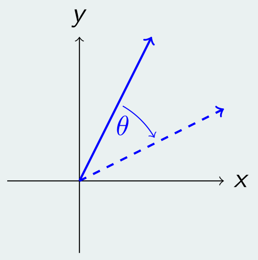
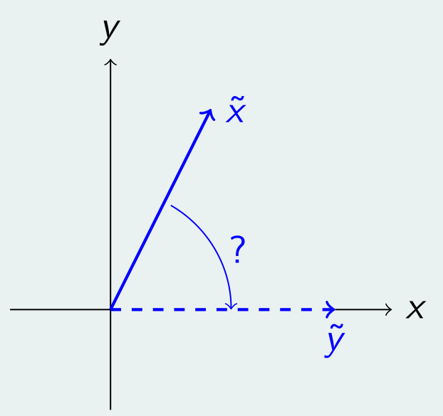
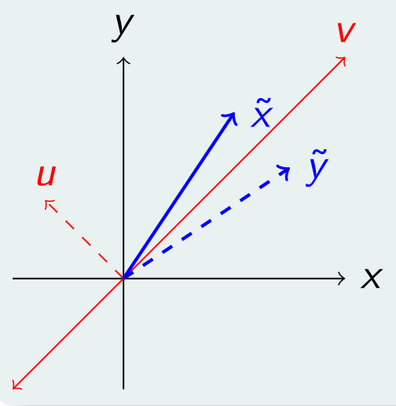
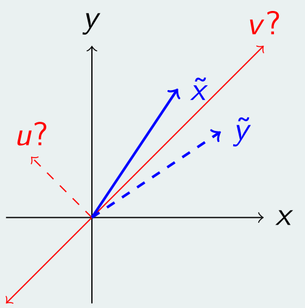

# QR

## Matrices ortogonales

Una matriz $Q \in \mathbb{R}^{n \times n}$ es ortogonal sii $Q^{-1} = Q^t$.

Equivalentemente $Q$ es ortogonal si:

- Las columnas de $Q$ forman un conjunto ortonormal (todas las columnas son ortogonales entre sí y tienen norma 2 igual a 1). Sean $v_1, \dots, v_n$ las columnas de $Q$.

    $$
    Q \text{ ortogonal} \iff \begin{cases}
    v^t_i v_j = 0 & i \neq j \\
    v^t_i v_i = ||v_i||^2_2 = 1 & \text{caso contrario}
    \end{cases}
    $$

- Las filas de $Q$ forman un conjunto ortonormal.

- $Q$ vista como una transformación lineal es una rotación o reflexión que preserva la norma 2.
    $$
    ||Qx||_2 = ||x||_2 \iff ||Qx||^2_2 = ||x||^2_2
    $$
    $$
    ||Qx||^2_2 = (Qx)^t (Qx) = x^t \underbrace{Q^t Q}_{I} x = x^t x = ||x||^2_2
    $$

### Propiedades

- $||Q||_2 = 1$

- $\kappa_2(Q) = 1$ (las matrices ortogonales son estables numéricamente)

- $det(Q) = \pm 1$

- $Q$ y $P$ ortogonales $\Rightarrow QP$ es ortogonal

## Factorización QR

Sea $A \in \mathbb{R}^{n \times n}$, $Q \in \mathbb{R}^{n \times n}$ ortogonal y $R \in \mathbb{R}^{n \times n}$ triangular superior tal que $A = QR$.

La factorización $QR$ es otra forma de descomponer una matriz para encontrar un sistema equivalente y fácil de resolver. Además, esta factorización tiene otras ventajas asociadas al hecho de que $Q$ es ortogonal y tiene un número de condición igual a 1.

Dado $b \in \mathbb{R}^n$ buscamos todos los $x \in \mathbb{R}^n$ tal que $Ax = b$.

$$
Ax = b \iff QRx = b \iff Rx = Q^t b
$$

Podemos encontrar $x$ en $O(n^2)$ operaciones elementales con backwards substitution ya que $R$ es triangular superior.

Veamos ahora cómo podemos obtener la factorización $QR$. Existen principalmente 2 métodos.

## Método Givens (rotationes)

El método de Givens consiste en realizar una serie de rotaciones en un subespacio de dimensión 2 para ir colocando ceros estratégicamente debajo de la diagonal principal.

### Rotaciones en el plano

Sea $W \in \mathbb{R}^{2 \times 2}$ una matriz ortogonal que rota cualquier vector una cantidad $\theta$ de grados en sentido horario.

$$
W = \begin{bmatrix}
cos(\theta) & sen(\theta) \\
-sen(\theta) & cos(\theta)
\end{bmatrix}
$$

La matriz $W$ codifica una rotación para un cierto ángulo $\theta$ el cual está fijo. Es decir, $W$ rota **cualquier** vector siempre por el mismo ángulo. Sin embargo, no nos interesa definir explícitamente el ángulo $\theta$. En cambio, queremos definir $W$ a partir de un vector en particular y hacia dónde lo queremos rotar, con el objetivo final de triangular una matriz de $2 \times 2$.

Dado $\tilde{x} \in \mathbb{R}^2$, queremos construir la matriz de rotación $W \in \mathbb{R}^{2 \times 2}$ para que rote al vector $\tilde{x}$ lo necesario para dejarlo "apoyado sobre el eje x". Es decir, $W \tilde{x} = \tilde{y}$ con $\tilde{y} \in \mathbb{R}^2$, $\tilde{y} = (||\tilde{x}||_2, 0)$.

En vez de buscar el ángulo y luego calcular los cosenos y senos, usamos las equivalencias trigonométricas (coseno = adyacente/hipotenusa, seno = opuesto/hipotenusa) para despejar los cosenos y senos sin necesidad de conocer el ángulo de rotación. De esta forma se puede obtener la matriz $W$ para cualquier par de vectores $\tilde{x}$ e $\tilde{y}$ que cumplan con las condiciones antes mencionadas.

$$
W = \begin{bmatrix}
\tilde{x}_1 / ||\tilde{x}||_2 & \tilde{x}_2 / ||\tilde{x}||_2 \\
-\tilde{x}_2 / ||\tilde{x}||_2 & \tilde{x}_1 / ||\tilde{x}||_2
\end{bmatrix}
$$

### Caso matriz $2 \times 2$

Si tenemos una matriz cualquiera $A \in \mathbb{R}^{2 \times 2}$, podemos triangularla de la siguiente manera. Primero definimos los vectores $\tilde{x}$ e $\tilde{y}$.

$$
A = \begin{bmatrix}
a_{11} & a_{12} \\
a_{21} & a_{22}
\end{bmatrix}
\hspace{2em}
\tilde{x} = \begin{bmatrix}
a_{11} \\
a_{21}
\end{bmatrix}
\hspace{2em}
\tilde{y} = \begin{bmatrix}
||\tilde{x}||_2 \\
0
\end{bmatrix}
$$

Por lo expuesto anteriormente, sabemos que existe $W \in \mathbb{R}^{2 \times 2}$ tal que $W \tilde{x} = \tilde{y}$. Luego:

$$
WA = \begin{bmatrix}
||\tilde{x}||_2 & * \\
0 & *
\end{bmatrix}
= R
$$

Como $W$ es ortogonal, su inversa es $W^t$.

$$
WA = R \iff W^t W A = W^t R \Rightarrow A = QR
$$

Donde $Q = W^t$ y $R$ es una matriz triangular superior.

### Caso matriz $n \times n$

Sea $A \in \mathbb{R}^{n \times n}$. Para el caso general de una matriz de $n \times n$ vamos a necesitar realizar muchas rotaciones para triangular la matriz. Cada rotación coloca un único cero debajo de la diagonal principal.

Para el primer paso definimos $\tilde{x} = \begin{bmatrix}
a_{11} \\
a_{21}
\end{bmatrix},
\tilde{y} = \begin{bmatrix}
||\tilde{x}||_2 \\
0
\end{bmatrix}$.

Al igual que el caso de $2 \times 2$ sabemos que existe $W \in \mathbb{R}^{2 \times 2}$ ortogonal tal que $W \tilde{x} = \tilde{y}$.

$$
W
= \begin{bmatrix}
w_{11} & w_{12} \\
w_{21} & w_{22}
\end{bmatrix}
= \begin{bmatrix}
\tilde{x}_1 / ||\tilde{x}||_2 & \tilde{x}_2 / ||\tilde{x}||_2 \\
-\tilde{x}_2 / ||\tilde{x}||_2 & \tilde{x}_1 / ||\tilde{x}||_2
\end{bmatrix}
$$

Ahora embebemos $W$ en una matriz identidad de $n \times n$ la cual llamamos $W_{12} \in \mathbb{R}^{n \times n}$ (los subíndices hacen referencia a las 2 coordenadas que definen el plano sobre el cual vamos a realizar la rotación).

$$
W_{12} = \begin{bmatrix}
w_{11} & w_{12} & 0 & \dots & 0 \\
w_{21} & w_{22} & 0 & \dots & 0 \\
0 & 0 & 1 & \dots & 0 \\
\vdots & \vdots & \vdots & \ddots & \vdots \\
0 & 0 & 0 & \dots & 1
\end{bmatrix}
$$

El primer paso de la factorización QR utilizando el método de Givens resulta:

$$
W_{12} A = \begin{bmatrix}
* & * & \dots & * \\
0 & * & \dots & * \\
a_{31} & a_{32} & \dots & a_{3n} \\
\vdots & \vdots & \vdots & \vdots \\
a_{n1} & a_{n2} & \dots & a_{nn}
\end{bmatrix}
$$

Para el segundo paso redefinimos $\tilde{x} = \begin{bmatrix}
a^1_{11} \\
a^1_{31}
\end{bmatrix},
\tilde{y} = \begin{bmatrix}
||\tilde{x}||_2 \\
0
\end{bmatrix}$. Notemos que siempre usamos los elementos resultantes del paso anterior, al igual que la factorización $LU$. Nuevamente sabemos que existe $W \in \mathbb{R}^{2 \times 2}$ ortogonal tal que $W \tilde{x} = \tilde{y}$, y la embebemos junto a la identidad en una matriz de $n \times n$.

$$
W_{13} = \begin{bmatrix}
w_{11} & 0 & w_{12} & 0 & \dots & 0 \\
0 & 1 & 0 & 0 & \dots & 0 \\
w_{21} & 0 & w_{22} & 0 & \dots & 0 \\
0 & 0 & 0 & 1 & \dots & 0 \\
\vdots & \vdots & \vdots & \vdots & \ddots & \vdots \\
0 & 0 & 0 & 0 & \dots & 1
\end{bmatrix}
$$

Multiplicamos a izquierda el resultado del paso anterior:

$$
W_{13} W_{12} A = \begin{bmatrix}
* & * & \dots & * \\
0 & * & \dots & * \\
0 & * & \dots & * \\
a_{41} & a_{42} & \dots & a_{4n} \\
\vdots & \vdots & \vdots & \vdots \\
a_{n1} & a_{n2} & \dots & a_{nn}
\end{bmatrix}
$$

Como vamos colocando un cero en cada paso, necesitamos barrer todas las posiciones debajo de la diagonal principal. El paso genérico se define para todo $i = 1 \dots n-1$, para todo $j = i+1 \dots n$. En el paso $ij$ colocamos un cero en la posición $ji$.

$$
\tilde{x} = \begin{bmatrix}
a^{i-1}_{ii} \\
a^{i-1}_{ji}
\end{bmatrix}
\hspace{2em}
\tilde{y} = \begin{bmatrix}
||\tilde{x}||_2 \\
0
\end{bmatrix}
\hspace{2em}
W_{ij} =
\begin{bmatrix}
1 & \dots & 0 & \dots & 0 & \dots & 0 \\
\vdots & \ddots & \vdots & \vdots & \vdots & \vdots & \vdots \\
0 & \dots & w_{ii} & \dots & w_{ij} & \dots & 0 \\
\vdots & \vdots & \vdots & \ddots & \vdots & \vdots & \vdots \\
0 & \dots & w_{ji} & \dots & w_{jj} & \dots & 0 \\
\vdots & \vdots & \vdots & \vdots & \vdots & \ddots & \vdots \\
0 & \dots & 0 & \dots & 0 & \dots & 1 \\
\end{bmatrix}
$$

La factorización $QR$ completa se obtiene multiplicando $A$ por todas las matrices de rotación $W_{ij}$ (que como son ortogonales su inveresa es igual a su traspuesta):

$$
W_{n-1n} W_{n-2n} W_{n-2n-1} \dots W_{1n} \dots W_{13} W_{12} A = R \\
\iff A = \underbrace{W^t_{12} W^t_{13} \dots W^t_{1n} \dots W^t_{n-2n-1} W^t_{n-2n} W^t_{n-1n}}_{Q} R = QR
$$

## Método Householder (reflexiones)

El método de Householder consiste en aplicar sucesivas reflexiones para colocar ceros debajo de la diagonal principal. Una reflexión es una transformación lineal que refleja todo vector respecto a un hiper-plano. Si bien una reflexión concreta se puede modelar como una rotación, donde el método de Givens construye una matriz de rotación que tiene configurada un ángulo de rotación fijo, Householder solo define el plano de reflexión, y por lo tanto cada vector será rotado un ángulo distinto, el que sea necesario para reflejar el vector respecto al plano. En una matriz de Householder lo que queda fijo es justamente el plano de reflexión.

### ¿Qué es una reflexión?

Una reflexión se define a partir de un hiper-plano. En el caso de $\mathbb{R}^2$ sería una recta. Sea $H \in \mathbb{R}^{2 \times 2}$ una matriz ortogonal que refleja respecto a la dirección $v$.

- $Hv = v$ pues la propia dirección de reflexión se mantiene constante al aplicar la transformación $H$.

- $Hu = -u$ pues la dirección ortogonal a la dirección de reflexión se invierte al aplicar la transformación $H$ (se puede pensar como que se rota 180°).

- $H \tilde{x} = \tilde{y}$ para cualquier otro caso. El ángulo que se forma entre $\tilde{x}$ y $v$ es exactamente igual al que se forma entre $\tilde{y}$ y $v$.

### ¿Cómo se construye la matriz $H$?

Como $u$ y $v$ forman una base por ser vectores ortogonales, podemos escribir $\tilde{x}$ y su reflexión $\tilde{y}$ como combinación lineal de ellos.

$$
\tilde{x} = \alpha v + \beta u
\hspace{2em}
\tilde{y} = \alpha v - \beta u
$$

Buscamos $H, W \in \mathbb{R}^{2 \times 2}$ tal que:

$$
H \tilde{x} = \tilde{y} \iff H \tilde{x} = \alpha v - \beta u \iff H \tilde{x} = \underbrace{\alpha v + \beta u}_{I \tilde{x}} - \underbrace{2 \beta u}_{W \tilde{x}} \iff H \tilde{x} = I \tilde{x} - W \tilde{x}
$$

Donde $W \tilde{x} \stackrel{\text{def } \tilde{x}}{=} W(\alpha v + \beta u) = \alpha W v + \beta Wu = 2 \beta u \iff \begin{cases}
W v = 0 \\
W u = 2 u
\end{cases}$

Asumiendo que $||u||_2 = 1$, definimos $P \in \mathbb{R}^{2 \times 2}$ como $P = u u^t$.

- $P$ es simétrica: $P^t = P$ \
    $P^t = (u u^t)^t = (u^t)^t u^t = u u^t = P$
- $PP^t = P$ \
    $PP^t = PP = (u u^t) (u u^t) = u (u^t u) u^t = u \underbrace{||u||^2_2}_{=1} u^t = u u^t = P$
- $Pu = u$ \
    $Pu = (u u^t) u = u (u^t u) = u \underbrace{||u||^2_2}_{=1} = u$
- $Pv = 0$ \
    $Pv = (u u^t) v = u (u^t v) = 0$ pues $u \perp v \Rightarrow u^t v = 0$

Si definimos $W = 2P$ tenemos $H = I - 2P$. Veamos que $H \tilde{x} = \tilde{y}$.

$$
H \tilde{x} = I \tilde{x} - 2P \tilde{x} = \alpha v + \beta u - 2P (\alpha v + \beta u) = \alpha v + \beta u - 2 \alpha \underbrace{Pv}_{=0} - 2 \beta \underbrace{Pu}_{u} = \alpha v - \beta u = \tilde{y}
$$

Finalmente tenemos $H = I - 2 u u^t$ con $H$ simétrica y ortogonal. Este mismo procedimiento se extiende a dimensiones más grandes.

### ¿Cómo podemos obtener $H$ a partir de $\tilde{x}$ e $\tilde{y}$?

Sean $\tilde{x}, \tilde{y} \in \mathbb{R}^n$ tal que $\tilde{x} \neq \tilde{y}$, $||\tilde{x}||_2 = ||\tilde{y}||_2$ (necesitamos que tengan la misma norma pues si no $H$ no podría ser ortogonal ya que estaría deformando el espacio además de reflejarlo). Por lo expuesto anteriormente existe $H \in \mathbb{R}^{n \times n}$ transformación de Householder tal que $H \tilde{x} = \tilde{y}$.

De forma similar al método de Givens en donde no queríamos buscar explícitamente el ángulo $\theta$ porque sabíamos exactamente a dónde queríamos rotar $\tilde{x}$, en el método de Householder pasa algo parecido. Queremos simplemente definir $H$ a partir de $\tilde{x}$ e $\tilde{y}$ (que luego vamos a elegir de forma conveniente para triangular la matriz).

$$
v = \tilde{x} + \tilde{y}
\hspace{2em}
u = \frac{\tilde{x} - \tilde{y}}{||\tilde{x} - \tilde{y}||_2}
\hspace{2em}
H = I - 2 u u^t = I - 2\frac{(\tilde{x} - \tilde{y})(\tilde{x} - \tilde{y})^t}{||\tilde{x} - \tilde{y}||^2_2}
$$

### Ejemplo $2 \times 2$

Sea $A \in \mathbb{R}^{2 \times 2}$. Definimos $\tilde{x}, \tilde{y} \in \mathbb{R}^2$ tal que $\tilde{x} \neq \tilde{y}$, $||\tilde{x}||_2 = ||\tilde{y}||_2$.

$$
A = \begin{bmatrix}
a_{11} & a_{12} \\
a_{21} & a_{22}
\end{bmatrix}
\hspace{2em}
\tilde{x} = \begin{bmatrix}
a_{11} \\
a_{21}
\end{bmatrix}
\hspace{2em}
\tilde{y} = \begin{bmatrix}
||\tilde{x}||_2 \\
0
\end{bmatrix}
$$

Observación: si $a_{21} = 0$ entonces $\tilde{x} = \tilde{y}$, pero de ser así $A$ ya estaría triangulada y no es necesario hacer ninguna transformación.

Sabemos que existe una transformación de Householder $H \in \mathbb{R}^{2 \times 2}$ tal que $H \tilde{x} = \tilde{y}$.

$$
HA = \begin{bmatrix}
||\tilde{x}||_2 & * \\
0 & *
\end{bmatrix}
= R
$$

Como $H$ es ortogonal, su inversa es $H^t$.

$$
HA = R \iff H^t H A = H^t R \Rightarrow A = QR
$$

Donde $Q = H^t$ y $R$ es una matriz triangular superior.

### Caso general $n \times n$

Sea $A \in \mathbb{R}^{n \times n}$. El procedimiento consiste en aplicar distintas transformaciones de Householder de manera recursiva. Primero se aplica a toda la matriz original $A$ para triangular la primer columna. Luego consideramos la submatriz formada desde la fila y columna $2$ hasta la $n$ y repetimos el proceso, triangulando la primer columna de esta submatriz que en realidad es la segunda columna de la matriz de $n \times n$.

#### Primer paso

Sean $\tilde{x}, \tilde{y} \in \mathbb{R}^n$ tal que:

$$
\tilde{x} = \begin{bmatrix}
a_{11} \\
a_{21} \\
\vdots \\
a_{n1}
\end{bmatrix}
\hspace{2em}
\tilde{y} = \begin{bmatrix}
||\tilde{x}||_2 \\
0 \\
\vdots \\
0
\end{bmatrix}
$$

Existe una transformación de Householder $H_1 \in \mathbb{R}^{n \times n}$ tal que $H_1 \tilde{x} = \tilde{y}$.

$$
H_1 = I - 2 u_1 u^t_1
\hspace{2em}
u_1 = \frac{\tilde{x} - \tilde{y}}{||\tilde{x} - \tilde{y}||_2}
$$

Obtenemos $A^1$ (la matriz resultante luego del primer paso de la factorización) multiplicando a izquierda por $H_1$.

$$
H_1 A^0 = \begin{bmatrix}
||\tilde{x}||_2 & a^1_{12} & \dots & a^1_{1n} \\
0 & a^1_{22} & \dots & a^1_{2n} \\
\vdots & \vdots & \vdots & \vdots \\
0 & a^1_{n2} & \dots & a^1_{nn} \\
\end{bmatrix}
= A^1
$$

#### Segundo paso

Sean $\tilde{x}, \tilde{y} \in \mathbb{R}^{n-1}$ tal que:

$$
\tilde{x} = \begin{bmatrix}
a^1_{22} \\
a^1_{32} \\
\vdots \\
a^1_{n2}
\end{bmatrix}
\hspace{2em}
\tilde{y} = \begin{bmatrix}
||\tilde{x}||_2 \\
0 \\
\vdots \\
0
\end{bmatrix}
$$

Existe una transformación de Householder $\tilde{H} \in \mathbb{R}^{(n-1) \times (n-1)}$ tal que $\tilde{H} \tilde{x} = \tilde{y}$.

$$
\tilde{H} = I - 2 u_2 u^t_2
\hspace{2em}
u_2 = \frac{\tilde{x} - \tilde{y}}{||\tilde{x} - \tilde{y}||_2} \in \mathbb{R}^{n-1}
$$

Embebemos $\tilde{H}$ adentro de $H_2 \in \mathbb{R}^{n \times n}$.

$$
H_2 = \begin{bmatrix}
1 & 0 \\
0 & \tilde{H}
\end{bmatrix}
$$

Obtenemos $A^2$ multiplicando a izquierda por $H_2$.

$$
H_2 A^1 = \begin{bmatrix}
a^1_{11} & a^1_{12} & a^1_{13} & \dots & a^1_{1n} \\
0 & ||\tilde{x}||_2 & a^2_{23} & \dots & a^2_{2n} \\
0 & 0 & a^2_{33} & \dots & a^2_{3n} \\
\vdots & \vdots & \vdots & \vdots & \vdots \\
0 & 0 & a^2_{n3} & \dots & a^2_{nn} \\
\end{bmatrix}
= A^2
$$

#### Paso $i$-ésimo

En el paso $i$-ésimo trabajamos con una transformación de Householder de $\mathbb{R}^{(n-i+1) \times (n-i+1)}$ que triangula la columna $i$-ésima, que a su vez es la primer columna de la submatriz formada desde la fila y columna $i$ hasta la $n$.

Sean $\tilde{x}, \tilde{y} \in \mathbb{R}^{n-i+1}$ tal que:

$$
\tilde{x} = \begin{bmatrix}
a^{i-1}_{ii} \\
a^{i-1}_{i+1i} \\
\vdots \\
a^{i-1}_{ni}
\end{bmatrix}
\hspace{2em}
\tilde{y} = \begin{bmatrix}
||\tilde{x}||_2 \\
0 \\
\vdots \\
0
\end{bmatrix}
$$

Existe una transformación de Householder $\tilde{H} \in \mathbb{R}^{(n-i+1) \times (n-i+1)}$ tal que $\tilde{H} \tilde{x} = \tilde{y}$.

$$
\tilde{H} = I - 2 u_i u^t_i
\hspace{2em}
u_i = \frac{\tilde{x} - \tilde{y}}{||\tilde{x} - \tilde{y}||_2} \in \mathbb{R}^{n-i+1}
$$

Embebemos $\tilde{H}$ adentro de $H_i \in \mathbb{R}^{n \times n}$.

$$
H_i = \begin{bmatrix}
I & 0 \\
0 & \tilde{H}
\end{bmatrix}
\hspace{2em}
I \in \mathbb{R}^{(i-1) \times (i-1)}
$$

Obtenemos $A^i$ multiplicando a izquierda por $H_i$.

$$
H_i A^{i-1} = \begin{bmatrix}
a^{i-1}_{11} & a^{i-1}_{12} & \dots & a^{i-1}_{1i} & a^{i-1}_{1i+1} & \dots & a^{i-1}_{1n} \\
0 & a^{i-1}_{22} & \dots & a^{i-1}_{2i} & a^{i-1}_{2i+1} & \dots & a^{i-1}_{2n} \\
\vdots & \vdots & \ddots & \vdots & \vdots & \vdots & \vdots \\
0 & 0 & \dots & ||\tilde{x}||_2 & a^i_{ii+1} & \dots & a^i_{in} \\
0 & 0 & \dots & 0 & a^i_{i+1i+1} & \dots & a^i_{i+1n} \\
\vdots & \vdots & \vdots & \vdots & \vdots & \vdots & \vdots \\
0 & 0 & \dots & 0 & a^i_{ni+1} & \dots & a^i_{nn}
\end{bmatrix}
= A^i
$$

#### Último paso

Luego de aplicar todas las $n-1$ transformaciones de Householder obtenemos la factorización $QR$. Recordemos que todas las $H_i$ son ortogonales y entonces su inversa es su traspuesta, y además el producto de todas las $H_i$ también es una matriz ortogonal.

$$
H_{n-1} \dots H_1 A = R \iff A = \underbrace{H^t_1 \dots H^t_{n-1}}_{Q} R = QR
$$

## Complejidad

El método de Givens tiene un costo de $O(4/3 n^3)$. \
El método de Householder tiene un costo de $O(2/3 n^3)$.

Como el método de Givens coloca un solo cero en cada paso, si la matriz a triangular es rala (ya tiene muchos ceros), Givens puede ser más eficiente que Householder ya que se puede selectivamente solo realizar los pasos para colocar los ceros donde haga falta y evitar pasos redundantes.

## Unicidad

Sea $A \in \mathbb{R}^{n \times n}$ inversible. La factorización $A = QR$ es única si pedimos que $r_{ii} > 0$ para todo $i = 1 \dots n$.
