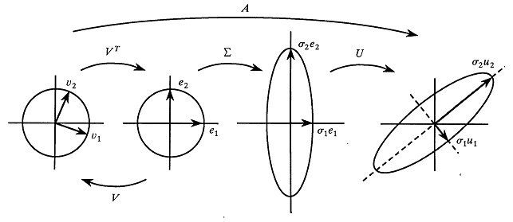

# SVD

## Definición

Sean $A \in \mathbb{R}^{m \times n}$ y $r = rango(A)$. Existen $U \in \mathbb{R}^{m \times m}$ ortogonal, $V \in \mathbb{R}^{n \times n}$ ortogonal y $\Sigma \in \mathbb{R}^{m \times n}$ pseudo-diagonal tales que:

$$
A = U \Sigma V^t
$$

La descomposición en valores singulares (SVD) utiliza 3 matrices muy específicas para descomponer $A$.

$$
\Sigma = \begin{bmatrix}
\sigma_1 & 0 & \dots & 0 & 0 & \dots & 0 \\
0 & \sigma_2 & \dots & 0 & 0 & \dots & 0 \\
\vdots & \vdots & \ddots & \vdots & \vdots & \vdots & \vdots \\
0 & 0 & \dots & \sigma_r & 0 & \dots & 0 \\
0 & 0 & \dots & 0 & 0 & \dots & 0 \\
\vdots & \vdots & \vdots & \vdots & \vdots & \vdots & \vdots \\
0 & 0 & \dots & 0 & 0 & \dots & 0
\end{bmatrix}
\hspace{2em}
U = \begin{bmatrix}
| & & | \\
u_1 & \dots & u_m \\
| & & |
\end{bmatrix}
\hspace{2em}
V = \begin{bmatrix}
| & & | \\
v_1 & \dots & v_n \\
| & & |
\end{bmatrix}
$$

Realizamos el siguiente desarrollo para encontrar una relación entre las distintas matrices y los valores singulares $\sigma_1 \dots \sigma_r$.

$$
\begin{align*}
A = U \Sigma V^t \iff AV = U \Sigma \iff
&\begin{cases}
A v_i = \sigma_i u_i & i = 1 \dots r & \hspace{1.6em} (1)\\
A v_i = 0 & i = r+1 \dots n & \hspace{1.6em} (2)
\end{cases}
\\
A = U \Sigma V^t \iff U^t A = \Sigma V^t \iff A^t U = V \Sigma^t \iff
&\begin{cases}
A^t u_i = \sigma_i v_i & i = 1 \dots r & \hspace{1em} (3) \\
A^t u_i = 0 & i = r+1 \dots m & \hspace{1em} (4)
\end{cases}
\end{align*}
$$

### ¿Quiénes son los $v_i$?

$$
A v_i = \sigma_i u_i
\iff
A^t A v_i = \sigma_i A^t u_i
\stackrel{(3)}{\iff}
A^t A v_i = \sigma_i \sigma_i v_i
\iff
A^t A v_i = \sigma^2_i v_i
\hspace{1em}\text{para todo } i = 1 \dots r
$$

$$
A v_i = 0
\iff
A^t A v_i = 0
\hspace{1em}\text{para todo } i = r+1 \dots n
$$

Deducimos entonces que los $v_i$ son los autovectores de $A^t A$.

- $A^t A$ es una matriz simétrica entonces existe una base ortonormal de autovectores.

- $A^t A$ es semi definida positiva entonces sus autovalores son $\geq 0$ pues $0 \leq v^t A^t A v = v^t \lambda v = \lambda ||v||^2_2 \stackrel{v \neq 0}{\Longrightarrow} 0 \leq \lambda$.

- $rango(A^t A) = rango(A) = r$ entonces hay $r$ autovalores no nulos y $0$ es autovalor con multiplicidad $n-r$.

Sean $\lambda_1 \geq \dots \geq \lambda_r > 0$ los autovalores no nulos de $A^t A$ con $v_1 \dots v_r$ sus autovectores asociados. Sean $v_{r+1} \dots v_n$ los autovectores asociados al autovalor nulo.

Definimos los valores singulares como $\sigma_i = \sqrt{\lambda_i} > 0$ para todo $i = 1 \dots r$, donde $\lambda_i$ son los autovalores de $A^t A$.

Los autovectores $v_1 \dots v_n$ forman un conjunto ortonormal y son los candidatos a ser las columnas de la matriz $V$.

### ¿Quiénes son los $u_i$?

A partir de las definiciones previas y utilizando la ecuación (1) definimos:

$$
A v_i = \sigma_i u_i \stackrel{\sigma_i > 0}{\iff} u_i = \frac{1}{\sigma_i} A v_i \hspace{1em}\text{para todo } i = 1 \dots r
$$

Como los $u_i$ son las columnas de $U$ matriz ortogonal, tenemos que verificar que $u_1 \dots u_r$ sea un conjunto ortonormal.

$$
u_i^t u_j
= \frac{1}{\sigma_i} (A v_i)^t \frac{1}{\sigma_j} A v_j
= \frac{1}{\sigma_i \sigma_j} v_i^t A^t A v_j
\stackrel{\mathclap{\substack{v_j \text{ autovector de } A^t A \\ \Big\uparrow}}}{=}
\frac{\lambda_j}{\sigma_i \sigma_j} v_i^t v_j
\stackrel{\mathclap{\substack{v_i \perp v_j \\ \Big\uparrow}}}{=}
0
$$

$$
u_i^t u_i
= \frac{1}{\sigma_i} (A v_i)^t \frac{1}{\sigma_i} A v_i
= \frac{1}{\sigma_i \sigma_i} v_i^t A^t A v_i
\stackrel{\mathclap{\substack{v_i \text{ autovector de } A^t A \\ \Big\uparrow}}}{=}
\frac{\lambda_i}{\sigma_i \sigma_i} v_i^t v_i
\stackrel{\mathclap{\substack{||v_i||^2_2 = 1 \\ \Big\uparrow}}}{=}
\frac{\lambda_i}{\sigma_i \sigma_i}
\stackrel{\mathclap{\substack{\lambda_i = \sigma_i^2 \\ \Big\uparrow}}}{=}
1
$$

Los $r$ vectores $u_1 \dots u_r$ pertenecen a $Im(A)$ que tiene $dim(Im(A)) = r$. Como son un conjunto ortonormal entonces son una base ortonormal de $Im(A)$.

El resto de los $u_{r+1} \dots u_m$ tienen que pertenecer al $Nu(A^t)$ por la ecuación (4). $Im(A)$ está en suma directa con su ortogonal: $Im(A) \oplus Im(A)^\perp = \mathbb{R}^m$. Como $Im(A)^\perp = Nu(A^t)$, basta tomar $u_{r+1} \dots u_m$ como una base ortonormal de $Nu(A^t)$ y así el conjunto $u_1 \dots u_m$ forma una base ortonormal de todo $\mathbb{R}^m$ y son los candidatos a ser las columnas de la matriz ortogonal $U$.

### Conclusión

- $\sigma_i = \sqrt{\lambda_i} > 0$ con $\lambda_i$ autovalor no nulo de $A^t A$.

- $v_1 \dots v_n$ base ortonormal de autovectores de $A^t A$.

- $u_1 \dots u_r$ base ortonormal de $Im(A)$ con $u_i = \frac{1}{\sigma_i} A v_i$.

- $u_{r+1} \dots u_m$ base ortonormal de $Im(A)^\perp = Nu(A^t)$.

Es fácil verificar que si construimos $U$, $\Sigma$ y $V$ a partir de estas definiciones se cumplen las 4 ecuaciones planteadas anteriormente y las matrices forman la descomposición SVD de $A = U \Sigma V^t$. Además, se puede hacer un análisis similar para concluir que $u_1 \dots u_m$ es una base ortonormal de autovectores de $A A^t$.

## Interpretación geométrica

La descomposición SVD tiene una interpretación geométrica muy interesante. Cada matriz $U$, $\Sigma$ y $V$ cumple una función específica.

La matriz $V^t$ realiza un cambio de base mediante una rotación, en donde los autovectores $v_i$ quedan alineados con los vectores canónicos $e_i$. Luego la matriz $\Sigma$ expande o contrae el espacio sobre cada uno de los vectores canónicos. Finalmente la matriz $U$ realiza otro cambio de base mediante una rotación.

## Propiedades

- $||A||_2 = \sigma_1$ \
    La norma 2 cuantifica la máxima deformación del espacio realizada por la transformación $A$. El hecho de que sea igual a $\sigma_1$ se corresponde con la interpretación geométrica, en donde dijimos que luego de rotar con $V^t$, la matriz $\Sigma$ expande o contrae el espacio sobre cada dirección canónica acorde a los valores singulares $\sigma_1 \geq \sigma_2 \geq \dots \geq \sigma_r$.

- $\kappa_2(A) = \frac{\sigma_1}{\sigma_n}$

- $||A||_F = \sqrt{\sigma_1^2 + \dots + \sigma_r^2}$

## Aplicaciones

PCA
